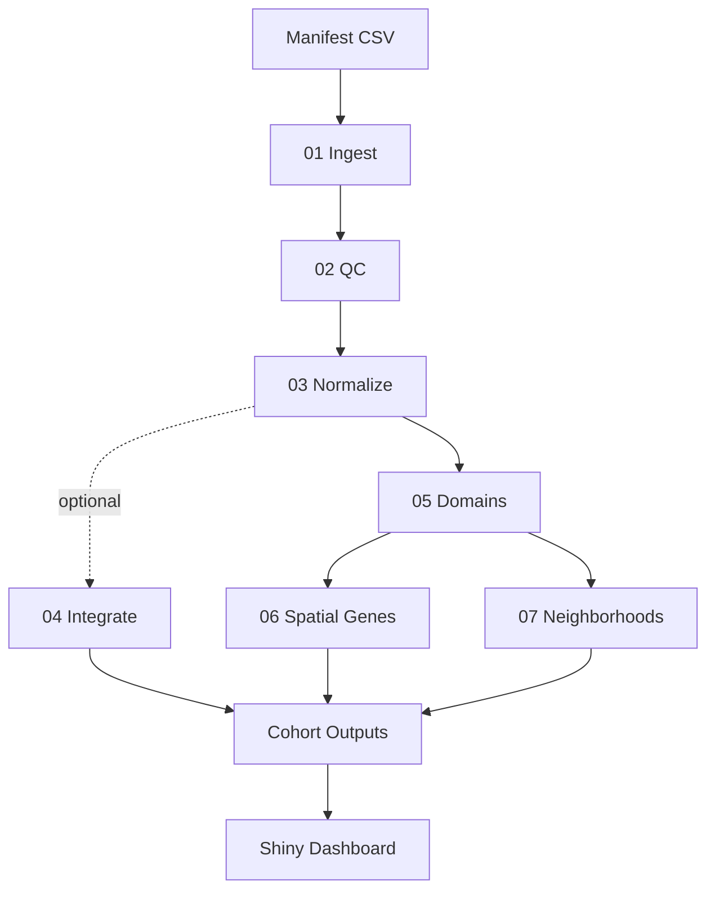

# Spatial Insights Cohort

[](https://www.r-project.org/)
[](https://www.nextflow.io/)
[](LICENSE)
[](https://github.com)

> **Production-ready spatial transcriptomics pipeline** that transforms raw Visium data into business-ready insights through automated QC, domain detection, and interactive visualization.

---

## 🎯 Overview

**Spatial Insights Cohort** is an end-to-end bioinformatics pipeline built with Nextflow and R that processes cohorts of spatial transcriptomics samples (10x Visium). It standardizes analysis workflows, generates publication-quality outputs, and provides an interactive Shiny dashboard for stakeholder review.

**Perfect for**: Research teams, core facilities, and biotech companies analyzing spatial gene expression data at scale.

---

## ✨ Key Features

- 🔄 **Automated Pipeline**: 7-step workflow from raw data to insights
- 📊 **Interactive Dashboard**: Shiny app for exploring results without code
- 🎨 **Publication-Ready**: High-quality plots and CSV summaries
- 🔬 **Spatial Analysis**: Domain detection, variable genes, neighborhood patterns
- 📈 **Quality Control**: Comprehensive QC metrics and filtering
- 🚀 **Scalable**: Process entire cohorts with resume capability
- 📦 **Reproducible**: Conda environment + Nextflow provenance tracking

---

## 🚀 Quick Start

### 1. Setup Environment
```bash
# Clone repository
git clone https://github.com/yourusername/Spatial_Insights_Cohort.git
cd Spatial_Insights_Cohort

# Create conda environment
conda env create -f environment.yml
conda activate spatial_insights_cohort
```

### 2. Run Pipeline
```bash
# Process cohort (uses DLPFC Visium data by default)
nextflow run main.nf -profile local \
  --manifest assets/cohort_manifest_template.csv \
  --steps "01,02,03,04,05,06,07" \
  --max_samples 12 \
  -resume
```

### 3. Launch Dashboard
```bash
# Start interactive Shiny app
R -e "shiny::runApp('app')"
# Open browser to http://localhost:7117
```

---

## 📊 Pipeline Workflow



### Pipeline Steps

| Step | Name | Purpose | Key Outputs |
|------|------|---------|-------------|
| **01** | Ingest | Load and cache Visium data | Per-sample RDS files |
| **02** | QC | Filter low-quality spots | QC summaries, plots |
| **03** | Normalize | Log-normalize + PCA | Normalized data, PCA diagnostics |
| **04** | Integrate | Cohort-level integration (optional) | UMAP, batch correction |
| **05** | Domains | Spatial domain detection | Domain assignments, stability scores |
| **06** | SVG | Spatially variable genes | Ranked gene lists, consensus |
| **07** | Neighborhoods | Domain adjacency analysis | Adjacency matrices, top pairs |

---

## 📁 What You Get

### Outputs Directory Structure
```
outputs/
├── qc/                      # Quality control
│   ├── qc_summary_postfilter.csv
│   ├── qc_thresholds.csv
│   └── plots/*.png
├── integration/             # Normalization & integration
│   ├── per_sample_norm_summary.csv
│   └── plots/*_pca_var.png
├── domains/                 # Spatial domains
│   ├── domains_cohort_summary.csv
│   ├── *_stability.csv
│   └── plots/*_domains.png
├── svg/                     # Spatially variable genes
│   ├── svg_ranked_*.csv
│   ├── svg_cohort_summary.csv
│   └── svg_consensus_top50.csv
├── neighborhood/            # Neighborhood analysis
│   ├── neighborhood_matrix_*.csv
│   └── neighborhood_cohort_summary.csv
└── run_metadata.json        # Provenance tracking
```

### Business-Ready Deliverables
- ✅ **CSV summaries** for analytics and BI pipelines
- ✅ **PNG plots** for presentations and reports
- ✅ **Interactive dashboard** for stakeholder review
- ✅ **Validation reports** for quality assurance
- ✅ **Metadata tracking** for reproducibility

---

## 🎨 Shiny Dashboard

The interactive dashboard provides:

- **Overview**: Cohort-level KPIs and run metadata
- **Domains**: Spatial domain visualizations with stability metrics
- **Spatial Genes**: Top spatially variable genes with rankings
- **Neighborhoods**: Domain adjacency heatmaps
- **Compare**: Side-by-side sample comparison

---

## 🔧 Configuration

### Key Parameters

```bash
--manifest        # Path to cohort manifest CSV (required)
--steps           # Pipeline steps to run (default: "01,02,03,05,06,07")
--max_samples     # Limit number of samples (0 = all)
--dataset         # Dataset name (default: "dlpfc")
--input_spe_rds   # Custom SpatialExperiment RDS file
--validate_only   # Run validation without execution
```

### QC Thresholds

Default filtering criteria (configurable in `scripts/02_qc.R`):
- Minimum counts per spot: **500**
- Minimum genes per spot: **200**
- Maximum mitochondrial %: **20%**
- Keep tissue spots only: **TRUE**

---

## 📊 Example Results

### Sample Metrics (BC_01, BC_02)
- **Samples processed**: 2 breast cancer Visium samples
- **Spots analyzed**: ~4,000 per sample
- **Spatial domains**: 7 per sample
- **Domain stability**: 0.71 (high confidence)
- **Top spatially variable genes**: 50 consensus genes identified

### Performance
- **Runtime**: ~17 minutes for 2 samples
- **Data size**: 1.3GB processed files
- **Validation**: All checks passed ✅

---

## 🛠️ Technology Stack

- **Workflow**: Nextflow (DSL2)
- **Analysis**: R 4.3.3
- **Visualization**: Shiny, plotly, ggplot2
- **Spatial Analysis**: BayesSpace, spatialLIBD
- **Data Structures**: SpatialExperiment, SingleCellExperiment

### Key R Packages
- `spatialLIBD` - DLPFC Visium data access
- `BayesSpace` - Spatial domain detection
- `SpatialExperiment` - Spatial data structures
- `scater`, `scran` - Single-cell QC and normalization
- `shiny`, `plotly` - Interactive visualization

---

## 📖 Documentation

- [README.md](README.md) - This file
- [DEV_NOTES.md](DEV_NOTES.md) - Developer documentation
- [Task List](https://github.com/yourusername/Spatial_Insights_Cohort/issues) - Planned features

---

## 🤝 Use Cases

### Research Labs
- Process spatial transcriptomics cohorts at scale
- Standardize analysis workflows across projects
- Generate publication-quality figures

### Core Facilities
- Offer spatial analysis as a service
- Provide interactive results to clients
- Ensure reproducible analysis

### Biotech Companies
- Validate spatial biomarkers
- Compare treatment conditions
- Integrate with BI pipelines

---

## 📝 Citation

If you use this pipeline in your research, please cite:

```
Spatial Insights Cohort: A production-ready pipeline for spatial transcriptomics analysis
https://github.com/yourusername/Spatial_Insights_Cohort
```

---

## 📄 License

This project is licensed under the MIT License - see the [LICENSE](LICENSE) file for details.

---

## 🙏 Acknowledgments

- **spatialLIBD** team for DLPFC Visium data
- **BayesSpace** developers for spatial clustering
- **Nextflow** community for workflow framework
- **Bioconductor** for spatial transcriptomics infrastructure

---

## 📧 Contact

For questions, issues, or collaborations:
- **GitHub Issues**: [Report bugs or request features](https://github.com/yourusername/Spatial_Insights_Cohort/issues)
- **Email**: your.email@example.com

---

## 🚀 Project Status

**Status**: ✅ Stable - Production ready  
**Last Updated**: February 2026  
**Maintenance**: Active

---

**Built with ❤️ for the spatial transcriptomics community**
