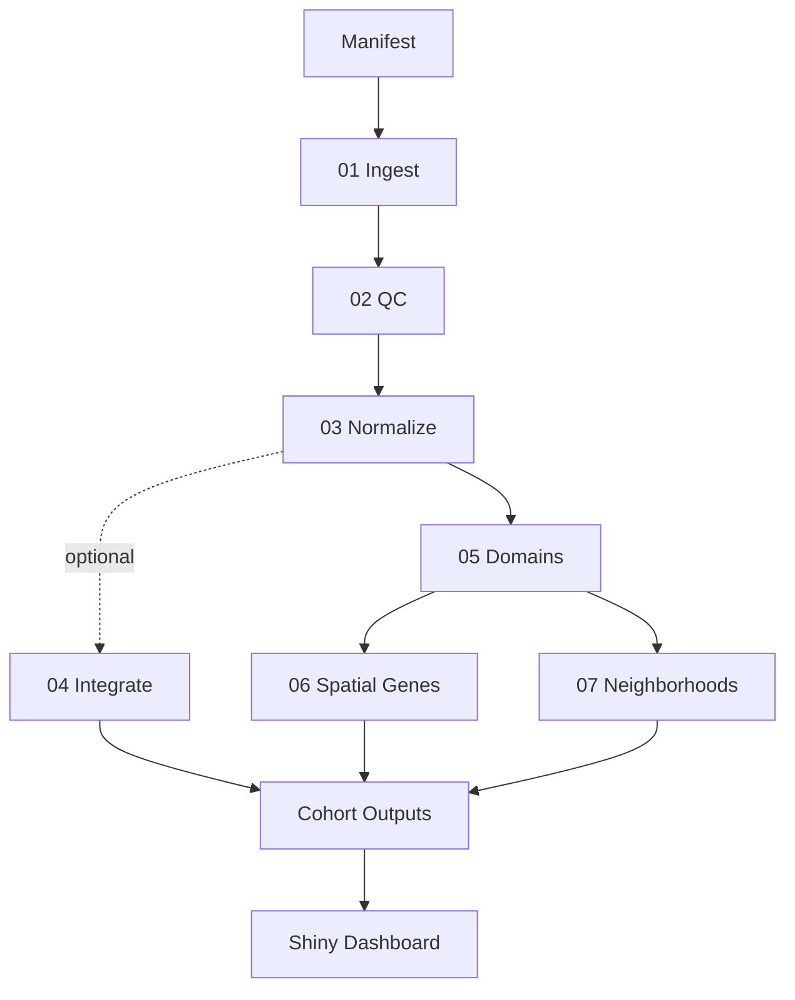

# Spatial Insights Cohort

This is an end-to-end spatial transcriptomics pipeline in R that processes a cohort of human DLPFC Visium samples, standardizes results, and feeds a Shiny dashboard for review.

## What you get
After a run, you get clean per-sample outputs plus cohort-level summaries that make it easy to validate data quality, compare samples, and communicate results to stakeholders.

**Core results**
- QC summaries and plots to confirm data health and filtering impact
- Normalized data with PCA diagnostics for each sample
- Spatial domains with stability metrics and per-sample domain counts
- Spatially variable genes (SVGs) with ranked gene lists and cohort consensus
- Neighborhood adjacency summaries to compare spatial organization across samples

**Business-ready deliverables**
- CSV summaries for analytics, reporting, or BI pipelines
- Plots for quick inspection or slide decks
- A Shiny dashboard for interactive review

## Results snapshot
- QC summaries and thresholds for filtering decisions (`outputs/qc/qc_summary_postfilter.csv`, `outputs/qc/qc_thresholds.csv`)
- Per-sample normalization summaries with PCA variance plots (`outputs/integration/per_sample_norm_summary.csv`, `outputs/integration/plots/*_pca_var.png`)
- Spatial domain calls with stability metrics and per-sample counts (`outputs/domains/*_stability.csv`, `outputs/domains/*_domain_counts.csv`)
- Ranked spatially variable genes plus cohort summary/consensus tables (`outputs/svg/svg_ranked_*.csv`, `outputs/svg/svg_cohort_summary.csv`, `outputs/svg/svg_consensus_top50.csv`)
- Neighborhood adjacency matrices, top-pair tables, and cohort summaries (`outputs/neighborhood/neighborhood_matrix_*.csv`, `outputs/neighborhood/neighborhood_top_pairs_*.csv`, `outputs/neighborhood/neighborhood_cohort_summary.csv`)

## Data
The pipeline uses the DLPFC Visium cohort from spatialLIBD by default. In the future, this will be expanded to support additional datasets and platforms.

## Run locally
From the repo root:

```
nextflow run main.nf -profile local --manifest assets/cohort_manifest_template.csv --steps "01,02,03,04,05,06,07" --max_samples 12 -resume
```

## Shiny dashboard
Run after the pipeline completes:

```
R -e "shiny::runApp('app')"
```

## Pipeline flow (high level)
1. Ingest and cache each sample
2. QC filtering with clear thresholds
3. Normalization and per-sample PCA
4. Spatial domains with stability checks
5. Spatially variable genes
6. Neighborhood adjacency summaries



## Outputs
Outputs are organized under `outputs/` with cached data under `data/processed/`.

**Key folders**
- `outputs/qc`: QC summaries, thresholds, and plots
- `outputs/integration`: Normalization summaries and (optional) cohort integration artifacts
- `outputs/domains`: Domain summaries, stability, and plots
- `outputs/svg`: Ranked SVGs and cohort consensus lists
- `outputs/neighborhood`: Neighborhood matrices and cohort summaries
- `outputs/validation`: Run validation reports
- `outputs/run_metadata.json`: Run metadata and provenance

## Project status
Project status: stable. No new features planned.
